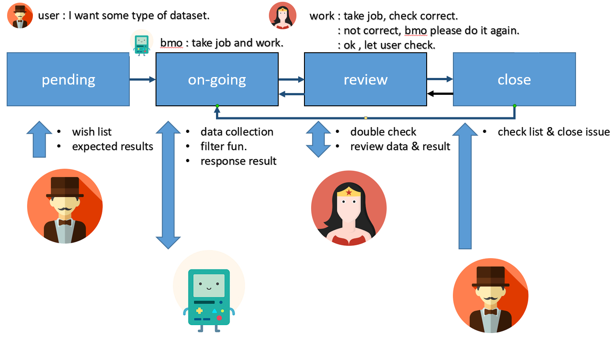

# dataset-collection-api

## API


## API Lifecycle


## Quick start
```shell=
# create  network 
docker network create -d bridge datasetbridge

docker build -t golang_1.11.2:1.0.0 -f docker/Dockerfile .
docker run --name task5-4 -ti -d  --network=datasetbridge -p 50010:22 -p 50011:80 golang_1.11.2:1.0.0
```
